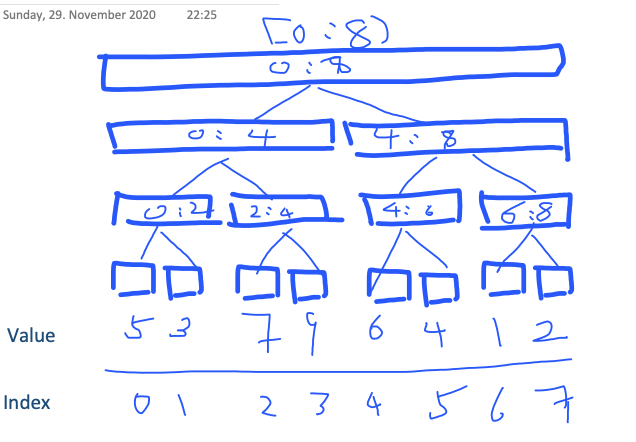

# Segment Tree



This segment tree keeps the minimum of each range.

To query [0: 6) = min ([0: 4), [4;6) and [6:8))

To update value at index `k`: 

1. update value at index `k`
2. update the parent at index `k = (k-1)/2` with the min value of the two children
3. repeat the step 2 until k == 0, where there is no parent


Note:

If we have N elements:

1. The last level of the tree have n elements, which `n >= N` and n is a power of 2. So you need to first find the n.
```c++
  n = 1;
  while(n < N) n *= 2;
```
2. The total number of elements in the tree is `2*n -1`. Remember to initialize the whole range.
```c++
  for (int i = 0; i < 2*n-1; ++i) 
    dat[i] = int_max;
```
3. The offset for elements in the last level is `n-1`. For example, `dat[0+n-1]` retrieves the first elements of the initial N elements you input.


